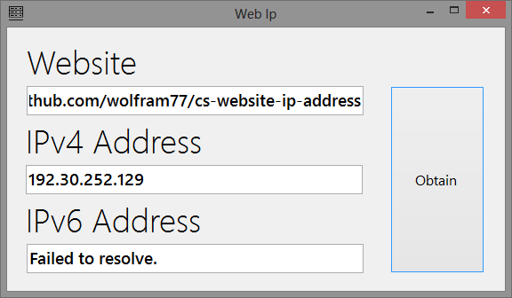

**Website IP** is a windows tool that you can use to determine the *IP address*
of the server hosting a website. Generally, one would do this by using `ping`
in command prompt with the website name.

This is faster:
- Just copy the whole *URL* and put it in
- Get the ip address, copy that too
- Use it where you needed

 
 

 
Open **Website IP**. Enter website URL.
 
 

 
Select `Obtain` to get the IP address of the web server.
 
 

